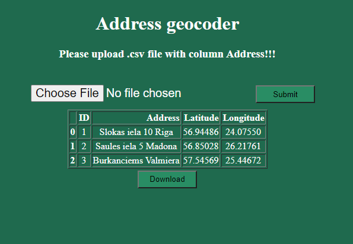

WEBapp 

Usage: 
1)Submit .csv file with addresses (need to have Address column).   
2)Table is showed with added Latitude and Longitude columns   
3)User can download the wit added data in .csv file 

Ready for upload to HEROKU!

